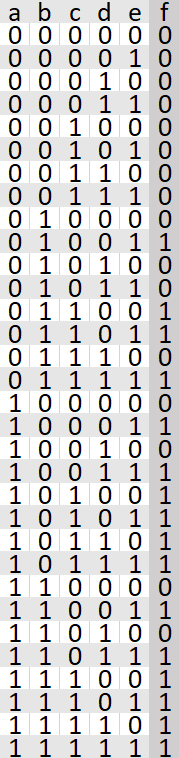

# itertools


# Введение

Основанный на итераторах код обеспечивает лучшие характеристики использования
памяти, чем код, основанный на использовании списков. Поскольку итераторы
не возвращает данные до тех пор, пока они не потребуются, отпадает
необходимость в хранении всего набора данных в памяти. Такая модель отложенной
обработки сглаживает отрицательное влияние подкачки и других побочных эффектов,
связанных с обработкой больших объёмов данных, на производительность.

## Определение

itertools - стандартный модуль Python, включающий в себя ряд функций,
предназначенных для обработки последовательностей.

itertools относят к функциональным модулям, ведь он был вдохновлён такими
языками программирования, как APL, Haskell, SML.


# Функции

## Бесконечные итераторы

Бесконечные итераторы - бесконечные последовательности, которые имеют паттерн.

Итератор | Аргументы | Результат | Пример
--- | --- | --- | ---
count() | start, [step] | start, start+step, start+2\*step, ... | `count(10) --> 10 11 12 13 14 ...`
cycle() | p | p0, p1, ... plast, p0, p1, ... | `cycle('строка') --> с т р о к а с т р о к а ...`
repeat() | elem [,n] | elem, elem, elem, ... бесконечно или столько сколько указано в количестве | `repeat(10, 3) --> 10 10 10` |

### Пример 1

Используется, когда необходим вечный цикл со знанием количествa пройденных
итераций.

Ниже представлено сравнение скорости работы скрипта с `count()` и без него.

Без `count()` скорость выполнения составит 0.0007404560001305072 секунды.

 ```python
i = 0
while True:
    if i == 200:
        break
    print(i)
    i += 1
 ```

 С `count()` скорость выполнения составит 0.0006238849996407225 секунды.

 ```python
import itertools
for i in itertools.count():
    if i == 200:
        break
    print(i)
 ```

## Итераторы, завершающиеся на кратчайшей входной последовательности

Итератор | Аргументы | Результат | Пример
--- | --- | --- | ---
accumulate() | p [,func] | p0, p0+p1, p0+p1+p2, ... | `accumulate([1, 2, 3, 4, 5]) --> 1 3 6 10 15`
chain() |  p, ..., q | p0, p1, ... plast, q0, q1, ... | `chain('abc', 'абв') --> a b c а б в`
chain.from_iterable() | iterable | p0, p1, ... plast, q0, q1, ... | `chain.from_iterable(['abc', 'абв']) --> a b c а б в`
compress() | data, selectors | (d[0] если s[0]), (d[1] если s[1]), ... | `compress('компр', [1, 0, 1]) --> к м`
dropwhile() | pred, seq | seq[n], seq[n+1], начинается при ложном предикате | `dropwhile(lambda x: x<5), [1, 4, 7, 8, 9]) --> 7, 8, 9`
filterfalse() | pred, seq | элементы последовательности, где предикат ложь | `filterfalse(lambda x: x%2, range(10)) --> 0 2 4 6 8`
takewhile() | pred, seq | seq[0], seq[1]? пока предикат ложь | `takewhile(lambda x: x<5, [1, 4, 5]) --> 1 4`
groupby() | iterable[, key] | подитераторы, сгруппированные по значению ключа  | <!--`[i[0] for i in itertools.groupby("ABCCDD"]) A B C D` -->
islice() | seq, [start,] stop [, step] | элементы последовательности[начало:конец:шаг] | `islice('ABCDEFG', 2, None) --> C D E F G`
pairwise() | iterable | (p[0], p[1]), (p[2], p[3]), ... | `pairwise('мишка') --> ми иш шк ка`
starmap() | func, seq | func(*seq[0]), func(*seq[1]), ... | `starmap(pow, [(2, 5), (3, 2)]) --> 32 9`
tee() | it, n | it1, it2, ... tin splits one iter | <!-- `starmap(pow, [(2, 5), (3, 2)]) -> 32 9` -->
zpi_longest() | p, q, ... | (p[0], q[0]), (p[1]), (p[1], q[1]), ... | `itertools.zip_longest('abcd', 'xy', fillvalue) --> ax by c- d-`

## `accumulate`

`accumulate` - очень полезная функция. Разберёмся, как можно её использовать
в наших программах.

Для начала нужно импортировать обозреваемый модуль `itertools`. Затем
инициализируем список с нашими значениям, например: `l = [1, 3, 4, 5, 10]`.
Теперь применим функцию к списку: `itertools.accumulate(l)`. Результат действия:
`<itertools.accumulate object at 0x00000176CD4BA2F0>` - `accumulate` объект, с
ним можно взаимодействовать как с итератором или как с последовательностью
(для этого нужно преобразовать объект).

Пример всего вышесказанного и немного больше:

```python
from itertools import accumulate
l = [1, 3, 4, 5, 10]
print(tuple(accumulate(l))) # 1, 4, 8, 13, 23
print(accumulate(l)) # <itertools.accumulate object at 0x00000176CD4BA2F0
a = accumulate(l)
print(next(a)) # 1
print(next(a)) # 4
```

## `chain`

`chain` ещё одна полезная функция, из названия можно определить её суть.
Занесённые строки в качестве аргументов `chain`, будут соединены между собой
как цепи.

```python
from itertools import chain
print(list(chain('це', 'пь'))) # ['ц', 'е', 'п', 'ь']
```
## `chain.from_iterable`

`chain.from_iterable` выполняет то же самое что и `chain`, но только для таких
последовательностей как: списки и кортежи.

```python
from itertools import chain
matrix = [[1, 2, 3,], [3, 2, 1]]
print(list(chain.from_iterable(matrix))) # [1, 2, 3, 3, 2, 1]
```

## Комбинационные итераторы

Комбинационные итераторы - последовательности, которые перебирают комбинации.

Итератор | Аргументы | Результат
--- | --- | ---
product() | p, q, ... [repeat=1] | декартово произведение, эквивалентное вложенному циклу for
permutations() |  p, [r] | кортеж длиной r, все возможные порядки без повторяющихся элементов, позиция важна
combinations_with_replacement() | p, r | кортеж длиной r, все возможные порядки c повторяющимися элементами, позиция не важна

### Пример 1

Ниже приведена таблица с примерами комбинационных итераторов.

Пример | Резуьтат
--- | ---
product('abcd', repeat=2) | `aa ab ac ad ba bb bc bd ca cb cc cd da db dc dd`
permutations('abcd', 2) | `ab ac ad ba bc bd ca cb cd da db dc`
combinations('abcd', 2) | `ab ac ad bc bd cd`
combinations_with_replacement('abcd', 2) | `aa ab ac ad bb bc bd cc cd dd`

### Пример 2

Получить последовательность, состоящую из последовательностей, в которых
первый элемент - масть карты, второй элемент её достоинство.

Решение:

```python
import itertools

dignities = [*map(str, range(1, 11)), 'валет', 'дама', 'король', 'туз']
suits = ['пики', 'трефы', 'черви', 'бубны']

print(*itertools.product(suits, dignities))

"""
Результат:
    ('пики', '1') ('пики', '2') ('пики', '3')
    ('пики', '4') ('пики', '5') ('пики', '6')
    ('пики', '7') ('пики', '8') ('пики', '9')
    ('пики', '10') ('пики', 'валет') ('пики', 'дама')
    ('пики', 'король') ('пики', 'туз') ('трефы', '1')
    ...
    ('бубны', 'дама') ('бубны', 'король') ('бубны', 'туз')
"""
```

`*map(str, range(1, 11))` - это выражение означает, что мы создаём диапозон
чисел от 1 до 10, затем используем функцию `map`, которая преобразовывает все
элеменеты последовательности согласно правилу, которое задаётся первым
аргументом. Если мы добавим это в наш список, мы получим `map` объект, поэтому
мы используем `*` - оператор распаковки. В данном случае произойдёт распоковка
элементов `map` объекта.

`itertools.product(suits, dignities)` - это `itertools` объект, который
осуществляет произведение элементов друг над другом. Можно провести аналогию с
таблицей умножения: у нас есть число от 1 до 10 по горизонтали и вертикали,
применяя `product`, мы получим таблицу умножения. Важно понимать, что, например,
при пересечении 3 и 2 мы получим не 6, а последовательность (3, 2).

### Пример 3

Решим задание 8 задание ЕГЭ, используя разбираемый модуль.

Задание:
(№ 3538) (Е. Джобс) Все 4-буквенные слова, составленные из букв П, Р, В, Д, А,
записаны в алфавитном порядке и пронумерованы. Вот начало списка:

```
1. АААА
2. АААВ
3. АААД
4. АААП
5. АААР
6. ААВА
...
```

Найдите номер первого слова в этом списке, которое не содержит гласных и
одинаковых букв.

Решение:

```python
import itertools

seq = 'авдпр'
without_repeat = tuple(itertools.combinations(seq, 4))

for idx, elem in enumerate(itertools.product(seq, repeat=4), 1):
    if 'а' not in elem and elem in without_repeat:
        print(idx, elem)
        break
```

Результат: `195 ('в', 'д', 'п', 'р')`.

Для задачи требуется объявить переменные seq и without_repeat. `авдпр`
записывается в том же порядке, что и идут последние буквы с 1 по 5 слов.
Выражением `tuple(itertools.combinations(seq, 4))` создаются комбинации, где
исключаются повтор букв.

`itertools.product(seq, repeat=4)` перемножает буквы между собой, получая слово
с длиной равной 4.

`enumerate(itertools.product(seq, repeat=4), 1)` - итератор, возвращающий два
элемента: индекс и значение. Индекс начинается со значения, которое задаётся
вторым аргументом, то есть у нас с 1.

Заключительным шагом является итерирование `enumerate` объекта и проверка
условия, если оно выполняется, то выводим в терминал индекс и значение
элемента. Дальше обрываем цикл.

### Пример 4

Задание: сформировать таблицу истинности, исходя из введённых значений
пользователем, и загрузить её в csv файл.

Решение:

Импортирум необходимы библиотеки: `itertools`, `csv`.

Инициализируем переменные и булеву функцию.

```python
variables = 'a b c d e'
func = 'not(a + b) * (c + e) <= d * b'
```

Здесь variables задаётся как строка для того, чтобы, если нужно будет,
использовать `input`, и тем самым предоставить пользователю возможность задовать
переменные. Тоже самое относится и к `func`.

Открываем запись файла, задав при этом символ новой строки (это важно,
так как MS Excel может прочитать стандартный `newline` символ не так, как нам
бы этого хотелось).

```python
with open('test.csv', 'w', newline='\n') as csvfile:
```

Инициализируем переменную, к которой присвоим `csv.writer`, с аргументом
рабочего файла.

```python
    writer = csv.writer(csvfile)
```

Записываем переменные и обозначение функции в первую строку файла.

```python
    writer.writerow(variables.replace(' ', '') + 'f')
```

Результатом `variables.replace(' ', '')` будет являться строка `abcd`, к
которой мы прибавляем `f`. Так как строка - последовательность, то каждый
её символ будет записан в отдельную ячейку.

Итерируем элементы `itertools.product`, аргументами которого `01` - правда и
ложь и количество повторов, которое считается длиной строки `variables`
без пробелов.

```python
    for row in itertools.product('01', repeat=len(variables.replace(' ', '')):
```

Выполняем строку `f'{variables.replace(" ", ", ")} = map(int, row)'`, как
выражение Питона с помощью функции `exec`. Другими словами мы выполняем
`a, b, c, d, e = 0, 0, 0, 0, 0`.

```python
        exec(f'{variables.replace(" ", ", ")} = map(int, row)')
```

Теперь остаётся только записать строку, как список, куда мы кладём
значения строки: `0, 0, 0, 0, 0` с помощью `[*row]` и прибавляем значение
функции с помощью тернарного оператора `['1' if eval(func) else '0']` - если
выполнение выражения `eval(func)` равно 1, то кладём в список `'1'`, иначе
`'0'`.

```python
        writer.writerow([*row] + ['1' if eval(func) else '0'])
```

Вышеописанный код:

```python
import itertools
import csv

variables = 'a b c d e'
func = 'not(a + b) * (c + e) <= d * b'

with open('test.csv', 'w', newline='\n') as csvfile:
    writer = csv.writer(csvfile)
    writer.writerow(variables.replace(' ', '') + 'f')

    for row in itertools.product('01', repeat=len(variables.replace(' ', '')):
        exec(f'{variables.replace(" ", ", ")} = map(int, row)')
        writer.writerow([*row] + ['1' if eval(func) else '0'])
```

Результат:


